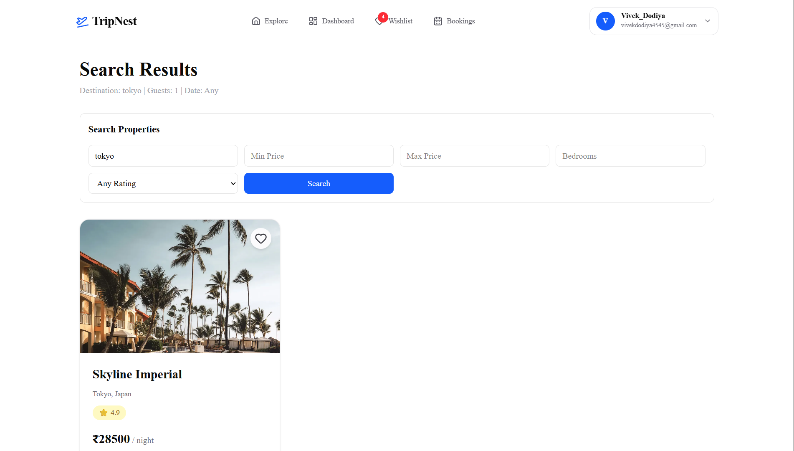
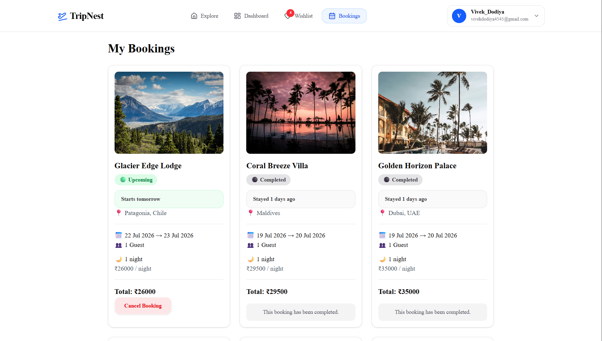

# TripNest ✈️

TripNest is a modern full-stack hotel booking platform inspired by Airbnb and Booking.com. It enables users to discover destinations, browse properties, save favorites, securely book stays with Stripe Checkout, leave reviews, and manage their trips through a fast and responsive interface.

## 🌐 Live Demo

https://tripnest-by-vivek.vercel.app

---

## 📸 Screenshots

| Home | Search |
|------|--------|
|  |  |

| Dashboard | Booking |
|----------|-----------|
|  |  |

---

## ✨ Features

- 🔐 Secure authentication with Supabase
- 👤 User profile management
- 🏡 Browse featured properties
- 🔍 Search and advanced filters
- ❤️ Wishlist system
- 📅 Booking system with conflict detection
- 💳 Stripe Checkout integration
- ⭐ Reviews and ratings
- 📊 Personalized dashboard
- 📱 Fully responsive Airbnb-inspired UI

---

## 🛠 Tech Stack

### Frontend

- Next.js 15 (App Router)
- React
- TypeScript
- Tailwind CSS v4
- shadcn/ui

### Backend

- Next.js Route Handlers
- Supabase

### Database

- PostgreSQL (Supabase)

### Authentication

- Supabase Auth
- Supabase SSR

### Payments

- Stripe Checkout
- Stripe Webhooks

---

## 🚀 Run Locally

```bash
git clone <repository-url>

cd tripnest

npm install

npm run dev
```

---

## 🔐 Environment Variables

```env
NEXT_PUBLIC_APP_URL

NEXT_PUBLIC_SUPABASE_URL
NEXT_PUBLIC_SUPABASE_ANON_KEY
SUPABASE_SERVICE_ROLE_KEY

NEXT_PUBLIC_STRIPE_PUBLISHABLE_KEY
STRIPE_SECRET_KEY
STRIPE_WEBHOOK_SECRET
```

---

## 👨‍💻 Author

**Vivek Dodiya**

B.Tech ICT • DA-IICT

---

## 📄 License

This project is licensed under the MIT License.